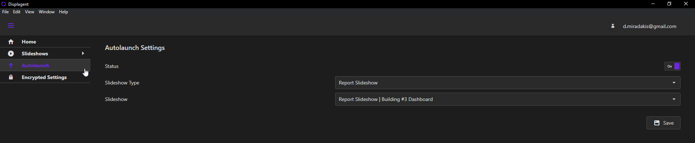

# Autolaunch Settings

To navigate to the Autolaunch Settings page, open the nav menu on the left side and click the Autolaunch link.

## Autolaunch Configurations

The configurations for autolaunch are defined below:

* `Status`: a toggle to easily enable or disable autolaunch.
* `Slideshow Type`: the Slideshow Type that you want to autolaunch to. The Slideshow Types are:
    * Report Slideshows
    * Dashboard Slideshows
    * Compound Slideshows (`coming soon`).
* `Slideshow`: the specific Slideshow that you want to autolaunch to. The choices in this dropdown are controlled by the selected Slideshow Type.

::: tip
Displagent will always autostart itself upon machine startup whether you have autolaunch enabled or not. Autostart is the app simply starting itself up whereas *autolaunch* is automatically launching to a specific Slideshow *after* autostart.
:::

After choosing each configuration, click the `Save` button.

  

