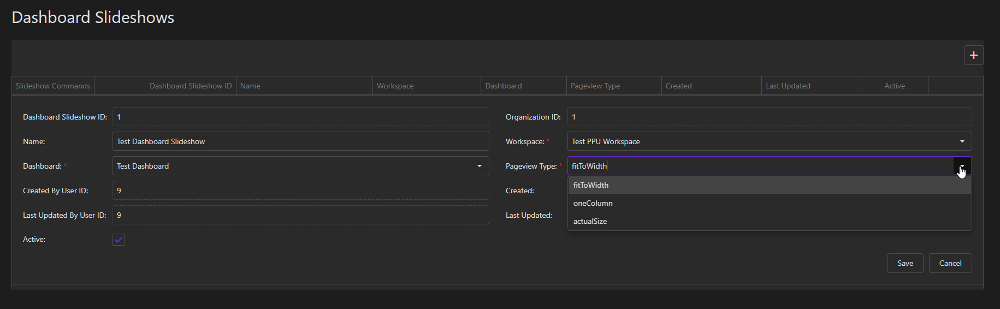

# Create a Dashboard Slideshow

The following steps below outline how to create a Dashboard Slideshow and its top-level configurations. 

## Add a new slideshow

On the page with the Dashboard Slideshows table, click the `+` button in the top-right corner of the table. When you do so, you will see a popup form appear where you can set certain top-level configurations for the slideshow.

  

## Slideshow Configurations

* `Name`: an optional name to assign to the slideshow.
* `Workspace`: the workspace that the target Power BI dashboard resides in.
* `Report`: the target Power BI dashboard.
* `Pageview Type`: a size setting for how you want the dashboard to appear.

::: warning Important
Since Power BI dashboards are much simpler than Power BI reports, there are not multiple levels of configurations. Instead, there are only these few top-level configurations.
:::

::: tip
Setting the Pageview Type is very useful for Power BI dashboards because this is not something that you can control with a simple embedUrl.
:::

After choosing each configuration, click the `Save` button.