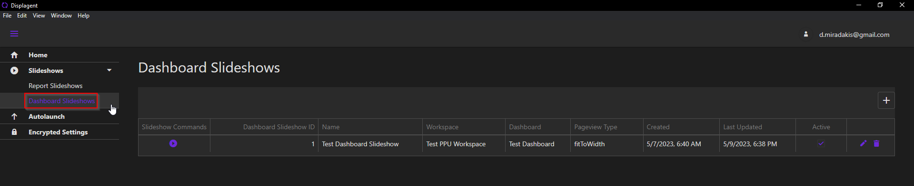

# Dashboard Slideshows Table

On this page of the app, you will find a central table/datagrid for all Dashboard Slideshows. To navigate to it, open the navbar on the left-side of the app, expand the Slideshows group, and click on the Dashboard Slideshows link.

  

Here, you can see each Dashboard Slideshow and the configurations assigned to them.