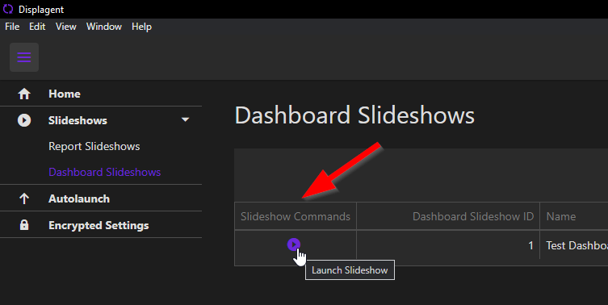
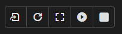

# Launch Dashboard Slideshow

To launch a Dashboard Slideshow, click the slideshow's `play` button on the Dashboard Slideshows Table.

    

## Slideshow Control Panel

On a Dashboard Slideshow's launch page, there is a slideshow control panel above the embedded Power BI dashboard. Within this control panel, you will see a `play` button, a `full screen/maximize` button, and a few others. The `play` button or `fullscreen/maximize` button should be all that you need.

    

::: tip
To exit fullscreen mode, simply press the `Escape` key.
:::

::: warning
You will notice that there are less controls on this control panel versus the Report Slideshow control panel. That is because dashboards are more limited in functionality than a report. For example, there is no refresh mechanic for an embedded Power BI dashboard because the refreshes are supposed to happen within the Power BI Service separately from the embedded dashboard instance.