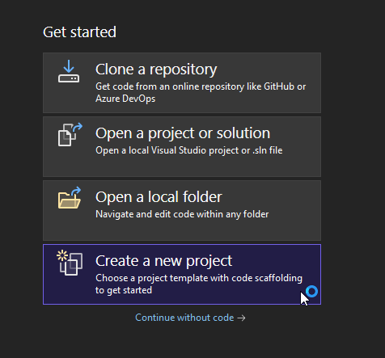
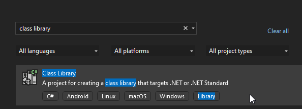
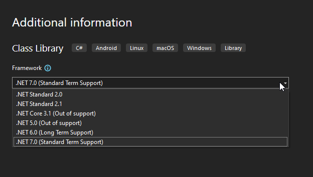

# Class Library Project

The magic of Didact's orchestration happens in your dedicated .NET class library project. This class library project contains your `Flows`, which are container classes for your background jobs/data pipelines/workflows. For simplicity, we will refer to it from here on out as the `Flow Library`.

::: tip
You can read more about `Flows` and other critical concepts in the Core Concepts section.
:::

## Visual Studio 2022

First, you need to create your `Flow Library`.

1. Open Visual Studio 2022.
2. Select `Create a new project` from the get started box on the right side.

    

3. Type `class library` in the project types searchbar and select the `Class Library` project type.

    

4. Give a name to your new project. The name can be whatever you would like. For our example, we will use `Flows Library`.
5. When asked to choose a framework, please choose a .NET version that is .NET 2.1 compatible.

::: tip
In simple terms, that means to choose literally `.NET Standard 2.1` or `.NET 3.0+`. However, I would **strongly recommend** choosing a .NET version that is still supported by Microsoft.
:::

    

