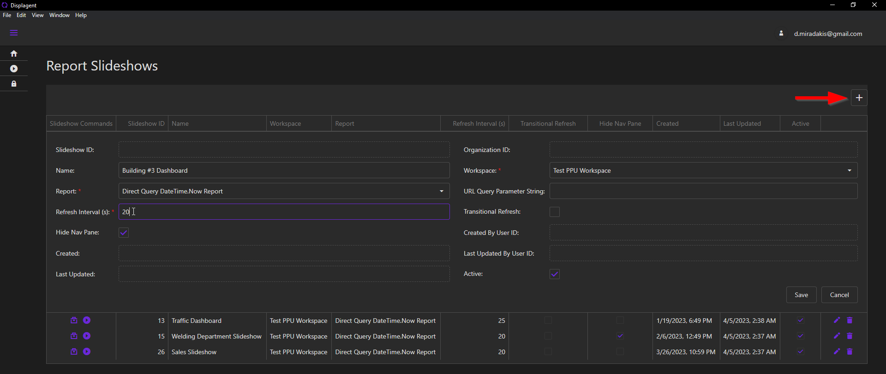

# Create a Report Slideshow

The following steps below outline how to create a Report Slideshow and its top-level configurations. 

::: tip
To learn how to build the actual slideshow items, please see the next page.
:::

## Add a new slideshow

On the page with the Report Slideshows table, click the `+` button in the top-right corner of the table. When you do so, you will see a popup form appear where you can set certain top-level configurations for the slideshow.

  

## Slideshow Configurations

* `Name`: an optional name to assign to the slideshow.
* `Workspace`: the workspace that the target Power BI report resides in.
* `Report`: the target Power BI report.
* `Refresh Interval`: the refresh interval of the slideshow **in seconds**, which can be between 15 seconds and 86,400 seconds (24 hours).
* `Hide Nav Pane`: hide the report's tab navigation menu upon report load.

After choosing each configuration, click the `Save` button.