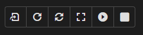
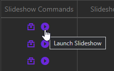

# Launch Report Slideshow

To launch a Report Slideshow, you have two options:
* Launch the slideshow from the slideshow control panel on the Buid Slideshow Page.
* Launch the slideshow from the slideshow's `play` button on the Report Slideshows Table.

## Slideshow Control Panel

On a slideshow's Build Slideshow page, there is a slideshow control panel in the middle of the page, above the embedded Power BI report. Within this control panel, you will see a `play` button as well as a `full screen/maximize` button. You can launch a slideshow manually using these and the other control buttons.

    

::: tip
To exit fullscreen mode, simply press the `Escape` key.
:::

::: tip
There is also a `Stop` button, a `Re-embed report` button, and a `Refresh` button. Be advised, however, that the `Refresh` button only works up to every 15 seconds.
:::

## Slideshow Play Button

On the main Report Slideshows Table, in the `Slideshow Commands`/`Commands` column, there is a `play` button. Clicking this `play` button automatically navigates to the slideshow's Slideshow Build page and auto-launches the slideshow in fullscreen mode.

::: tip
This is the easiest way to launch a slideshow.
:::

    

