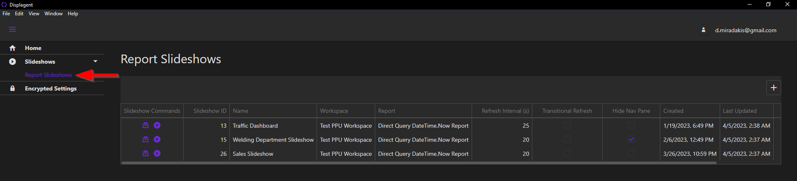

# Report Slideshows Table

On this page of the app, you will find a central table/datagrid for all Report Slideshows. To navigate to it, open the navbar on the left-side of the app, expand the Slideshows group, and click on the Report Slideshows link.

  

Here, you can see each Report Slideshow and the configurations assigned to them. The modifications that you make on this page apply to top-level configurations for each slideshow. To modify the actual content of each Report Slideshow, you need to visit its respective slideshow build page which you will read more about soon.