# Azure App Registration

This document outlines a step-by-step guide on how to create an Azure App Registration in your company's [Azure Active Directory](https://portal.azure.com/#view/Microsoft_AAD_IAM/ActiveDirectoryMenuBlade/~/RegisteredApps).

## Intro

In order for Displagent to access your Power BI content, it requires you to setup an Azure App Registration in your company’s [Azure Active Directory](https://portal.azure.com/#view/Microsoft_AAD_IAM/ActiveDirectoryMenuBlade/~/RegisteredApps).

## Microsoft Tool

Please navigate to the Microsoft-hosted [Power BI Azure App Registration assistant tool](https://app.powerbi.com/embedsetup). This tool allows you to choose a series of steps to easily create an Azure App Registration for Displagent.

At first glance, it might look a little overwhelming: don't worry! I have each step detailed below on how to navigate this.

1. Please click the `Embed for your organization` button.

    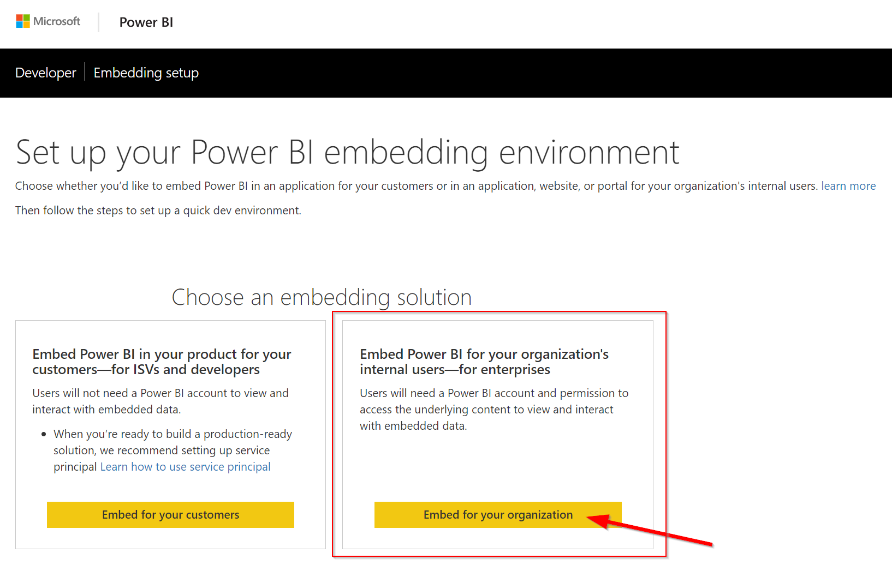

2. After clicking the button, you may be prompted to sign into Power BI; please do so.

    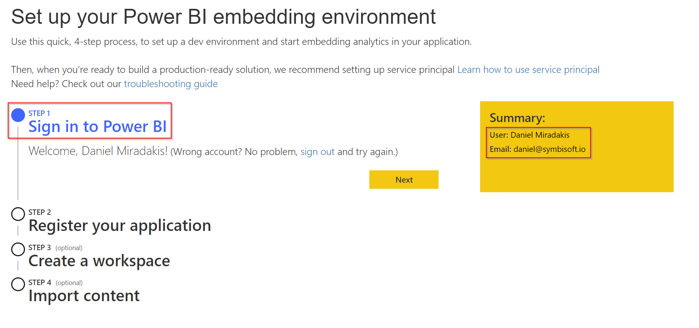

3. In the Application Name textbox, please type `Displagent`. In the Home Page URL textbox, please type `https://localhost/`. Don't worry about the Redirect URL textbox.

    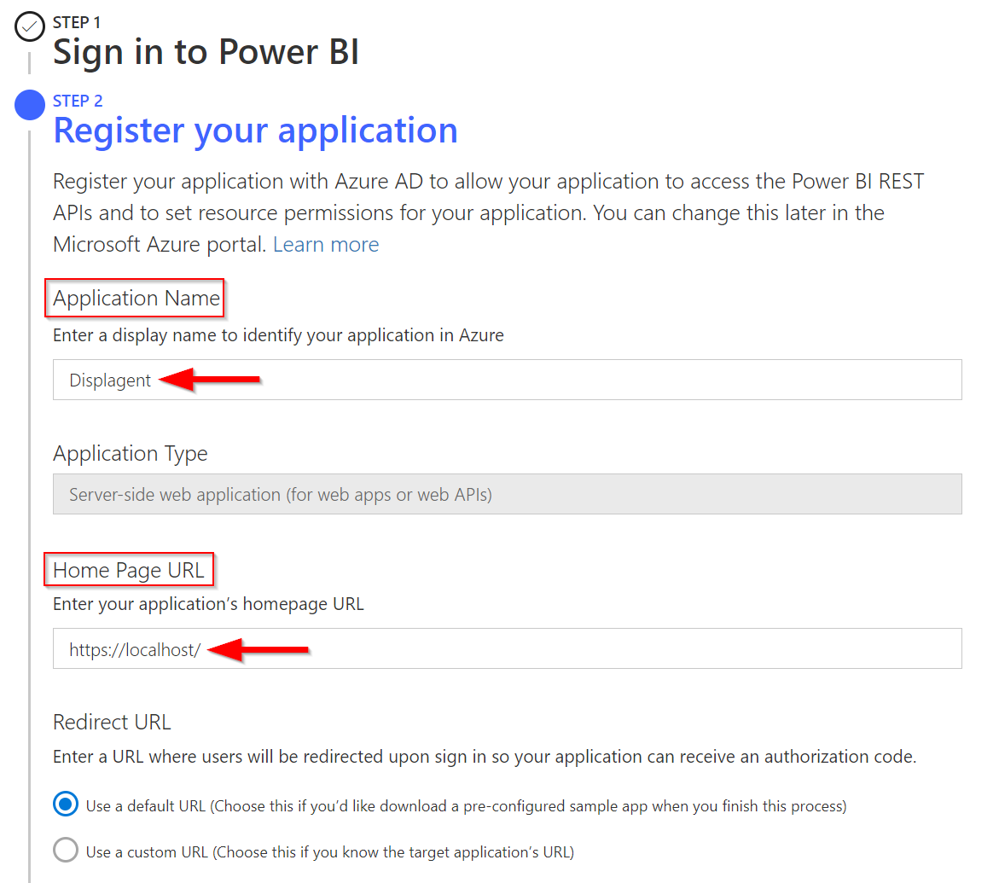

4. Please check the required permissions as indicated in the screenshot below. Then click the `Register` button.

    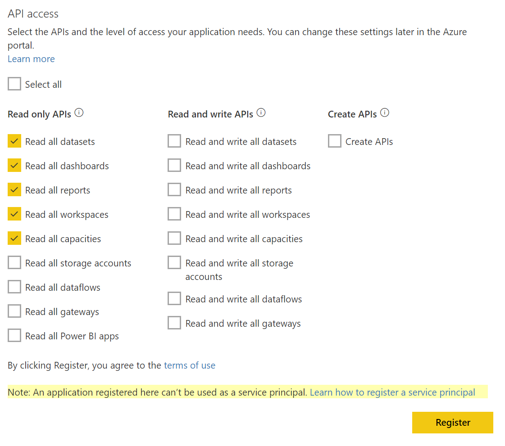

## Fetch IDs

Now that you've created the Azure App Registration, you need to actually fetch its IDs. You can find this information in your [Azure Active Directory](https://portal.azure.com/#view/Microsoft_AAD_IAM/ActiveDirectoryMenuBlade/~/RegisteredApps): once on the page, look for the new Azure App Registration that you made called `Displagent`.

You can also navigate to this page by logging into the Azure Portal and typing `azure active directory` in the searchbar at the top and navigating to the `App registrations` page.

    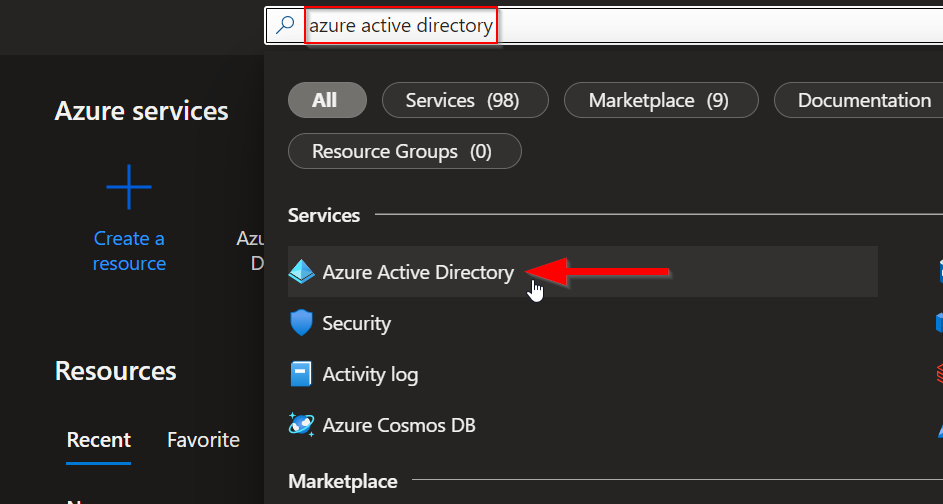

    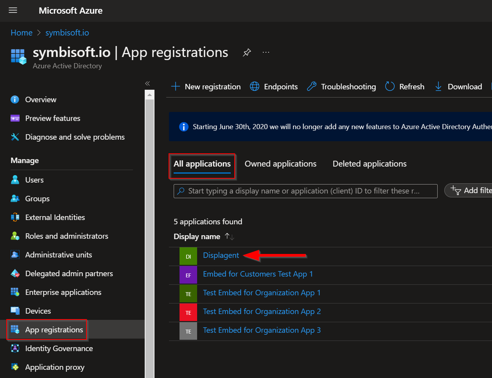

### Secret Value

Once on the `App registrations` page, click the `Displagent` app. Then navigate to the app's `Certificates & secrets` page. Click the `Client secrets` tab in the middle of the page, then click the `New client secret` button.

    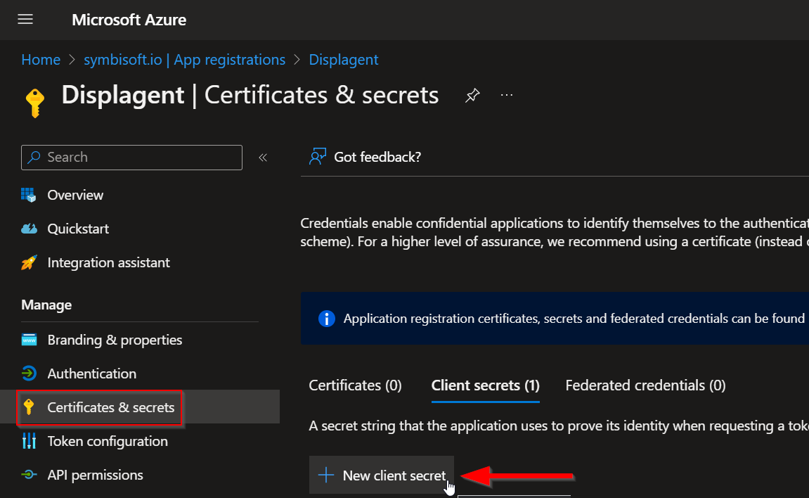

A new dialogue box should appear on the page with a Description textbox and an Expires dropdown.

In the Description textbox, add a short description such as `For Displagent`. In the Expires dropdown, choose a desirable expiry date.

::: warning MARK THIS IN YOUR CALENDAR!
This is VERY IMPORTANT that you remember this expiry! When this secret key expires, Displagent will NOT be able to access your Power BI content.

Therefore, I **strongly recommend** two things:
1. Make the expiry as large as possible for uninterrupted service.
2. Add a reminder to your calendar so as not to forget about this expiry. Currently, Displagent will NOT warn you ahead of time of when this secret key expires.
:::

Then click the `Add` button.

You should now see a new row appear for your newly-created secret.

::: warning Which column do I use?
You need the cryptographic string from the `Value` column located next to the `Secret ID` column.
:::

    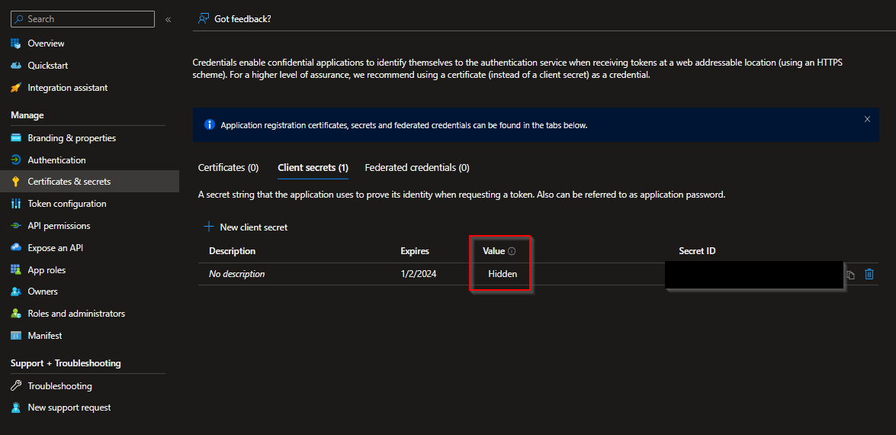

::: tip Save this for later
Save or copy this secret credential from the `Value` column! **It will NOT appear again!**
:::

### GUIDs

Now, look to the left-hand side navbar and click the `Overview` tab of the Azure App Registration.

On this tab, you will see several GUIDs near the top of the page: you need the `Application (client) ID` and the `Directory (tenant) ID` GUIDs.

::: tip Save this for later
Save or copy these two GUIDs!
:::

    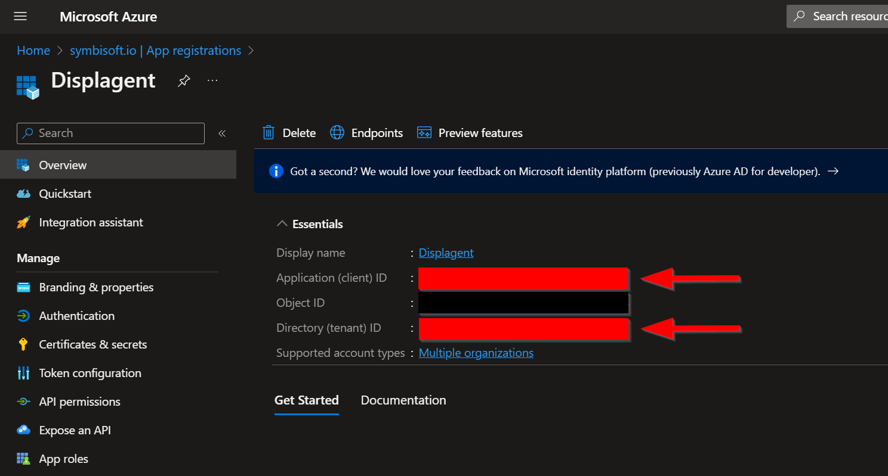

## Grant Admin Consent

One last thing: on the left-hand side navbar, navigate to the `API permissions` page.

In the middle of the page, you should see a checkmark button called `Grant admin consent for <your domain here>`. Click that checkmark button.

::: tip What is this?
This setting auto-allows your Power BI service account to use your new Azure App Registration programatically.
:::

    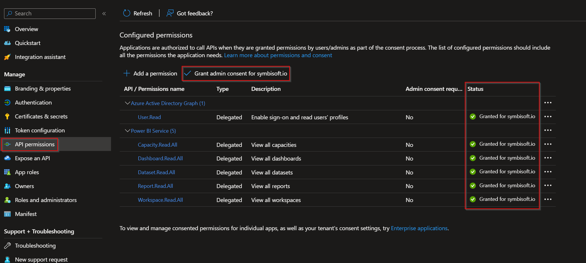

You will know that admin consent has been successfully granted when you see green check marks on the right-side `Status` column.

## Save IDs

Congratulations! You should now have all of the necessary permissions requirements and security provisions necessary for Displagent to embed your content.

To finalize this process, open Displagent, navigate to the `Encrypted Settings` page, and enter each credential in its respective textbox. I have provided a `Test` button on this page to test your credentials and ensure you can connect to your Power BI tenant.

::: tip Recall
These sensitive security credentials are *NOT* stored in Displagent's database or backend. Instead, they are saved to a local credentials file **on your machine**, and they are encrypted for added security.
:::

    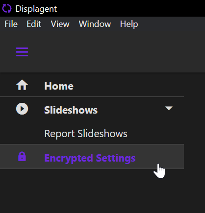

    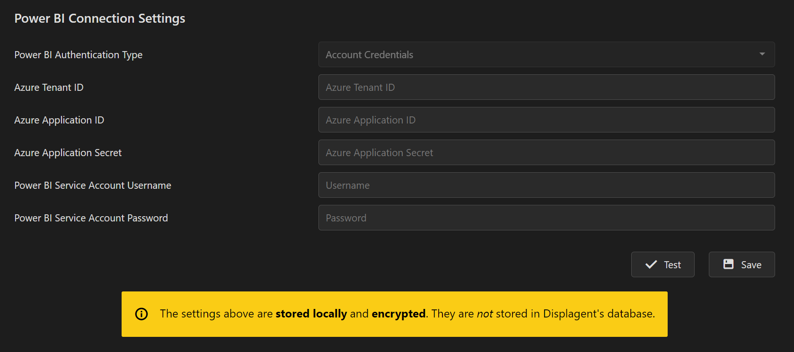

